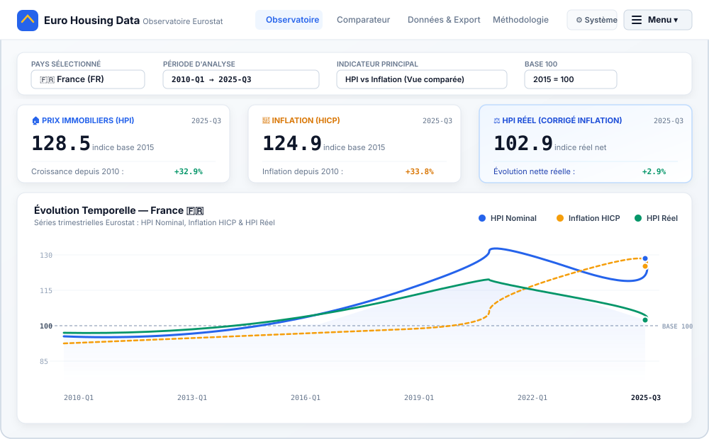

# <p align="center"><br /><b>Euro Housing Data</b></p>

<p align="center">
  <b>Observatoire Européen des Prix Immobiliers & de l'Inflation (2010 – 2026)</b><br />
  <i>Application Web Progressive (PWA) de haute précision connectée aux données officielles en libre accès d'Eurostat.</i>
</p>

<p align="center">
  
  
  
  
  
</p>

---

## 📸 Aperçu de l'Interface

<p align="center">
  
</p>

---

## 🌟 1. Fonctionnalités Clés & Organisation par Catégories

L'application intègre un **menu Hamburger interactif** et un volet de navigation organisant l'ensemble des fonctionnalités en 5 grandes catégories :

| Catégorie | Fonctionnalités & Outils | Description |
|---|---|---|
| **📊 Analyses & Observatoire** | • **Observatoire Principal**<br />• **Comparateur Multi-Pays**<br />• **Croissance Cumulée (« Depuis 2010 »)**<br />• **Segmentation Neufs vs Existants** | Analyse par pays (France, Allemagne, Espagne, etc.), superposition graphique internationale et barres comparatives de valorisation brute vs inflation. |
| **📁 Données & Exportations** | • **Explorateur de données**<br />• **Export CSV** (Excel / Python / R)<br />• **Export JSON** (API Developers)<br />• **Rebasification Dynamique** | Grille de données triable par colonne, moteur de recherche instantané, export direct et bascule Base 100 ($2015$, $2010\text{-Q1}$ ou Début de période). |
| **📚 Méthodologie & Références** | • **Méthodologie Complète**<br />• **Formule du HPI Réel**<br />• **Agrégation HICP Trimestrielle**<br />• **Datasets Eurostat** | Documentation mathématique intégrée, explication de la moyenne des 3 mois civils pour l'IPCH et transparence sur les codes de dimensions Eurostat. |
| **💡 Assistance & Guide** | • **Visite Guidée (Onboarding)**<br />• **Aide Contextuelle & Glossaire**<br />• **Infobulles interactives (Tooltips)** | Guide de bienvenue pas-à-pas pour les nouveaux utilisateurs, explications au survol des métriques clés et glossaire des termes économiques. |
| **⚙️ Système & Paramètres** | • **Paramètres Système & Version**<br />• **Vérification des mises à jour**<br />• **Forçage de la mise à jour**<br />• **Mises à jour automatiques en arrière-plan**<br />• **Thème Clair / Sombre / Système** | Contrôle des flux de synchronisation, horodatages de vérification, purge du cache local et installation silencieuse en tâche de fond. |

---

## ⚙️ 2. Paramètres Système & Mises à Jour en Arrière-Plan

L'application comprend un centre de contrôle système accessible depuis le menu Hamburger ou l'icône de réglages :

* **Informations de Version** :
  * **Version active** : `v2.4.0`
  * **Date de sortie officielle** : `27 septembre 2026`
  * **Date & heure de la dernière vérification** : horodatage précis et dynamique (`localStorage`).
  * **Statut de connectivité** : détection immédiate des états *En ligne* et *Hors-ligne*.
* **Bouton « Vérifier les mises à jour »** :
  * Interroge les serveurs Eurostat et vérifie la présence d'une nouvelle version du Service Worker.
  * Met à jour les séries temporelles sans recharger la page.
* **Bouton « Forcer la mise à jour »** :
  * Purge les bases de données **IndexedDB** (`euro_housing_db`) et les caches **CacheStorage**.
  * Réenregistre le Service Worker et force le rafraîchissement complet des séries officielles.
* **Système de Mises à Jour Automatiques en Arrière-Plan** :
  * **Exécution périodique** : intervalle paramétrable (5 min, 15 min, 30 min, 60 min).
  * **Détection intelligente** : vérifie la disponibilité de nouveaux trimestres dès la réactivation de l'onglet ou le retour de la connexion réseau.
  * **Installation silencieuse** : applique les nouveaux calculs et affiche une infobulle discrète de confirmation sans bloquer la navigation.

---

## 📐 3. Méthodologie Statistique & Formules

### 3.1 Indice Immobilier Réel (Real HPI)

Le **HPI Réel** mesure le pouvoir d'achat net du patrimoine immobilier neutralisé de l'inflation générale subie par les ménages :

$$\text{Real HPI}(t) = \left( \frac{\text{HPI nominal}(t)}{\text{HICP}(t)} \right) \times 100$$

* $\text{Real HPI} > 100$ : Gain de valeur réel (croissance des prix supérieure au coût de la vie).
* $\text{Real HPI} < 100$ : Érosion de valeur réelle sous l'effet de l'inflation.

### 3.2 Agrégation Trimestrielle de l'Inflation (HICP)

Le HICP mensuel est converti en valeur trimestrielle par moyenne arithmétique conforme aux pratiques d'Eurostat :

$$\text{HICP}_{Q_n} = \frac{\text{HICP}_{M_1} + \text{HICP}_{M_2} + \text{HICP}_{M_3}}{3}$$

---

## 🏗️ 4. Architecture Technique

```text
Eurostat REST API (ec.europa.eu)
      │
      ▼
Data Access Layer (src/api/)
  ├── eurostat.ts (JSON-stat 2.0 multi-dimensional parser)
  ├── hpi.ts (prc_hpi_q client)
  └── hicp.ts (prc_hicp_midx client)
      │
      ▼
System & Update Layer (src/hooks/useSystemUpdate.ts)
  ├── Background auto-update interval runner
  ├── Check for updates & Force update logic
  └── Service Worker update registration
      │
      ▼
Cache Layer (src/services/cache.ts & src/data/bootstrapData.ts)
  ├── IndexedDB (`euro_housing_db`)
  └── Embedded bootstrap fallback (10 core EU countries)
      │
      ▼
Normalization & Calculation (src/services/)
  ├── aggregation.ts (Monthly to quarterly arithmetic mean)
  ├── calculations.ts (Real HPI, QoQ, YoY, cumulative growth)
  └── normalization.ts (Unified QuarterlyObservation time-series)
      │
      ▼
Application State (src/hooks/)
  ├── useHousingData.ts (State management & auto-refresh)
  ├── useSystemUpdate.ts (Background auto-update & settings)
  ├── usePWAInstall.ts (In-app PWA install trigger)
  ├── useOnlineStatus.ts (Live connectivity detection)
  └── useTheme.ts (Theme persistence : Clair / Sombre / Système)
      │
      ▼
React UI (src/pages/ & src/components/)
  ├── Header & HamburgerMenu (Navigation catégorisée)
  ├── Observatoire (Dashboard avec barres cumulées & segmentation)
  ├── Comparateur (Superposition interactive multi-pays)
  ├── Données & Export (Table triable, CSV, JSON)
  ├── Méthodologie (Documentation & sources)
  ├── SystemSettingsModal (Paramètres & mises à jour)
  ├── OnboardingModal (Visite guidée interactive)
  └── ContextualHelpModal & Tooltips (Infobulles économiques)
```

---

## 🚀 5. Installation et Démarrage

### Prérequis
- Node.js >= 18
- npm

### Installation des dépendances
```bash
npm install
```

### Lancement du serveur de développement
```bash
npm run dev
```
L'application démarre sur `http://localhost:3000`.

### Build de production
```bash
npm run build
```

### Validation et tests unitaires
```bash
npm test
```

---

## 📊 6. Datasets Eurostat Utilisés

| Indicateur | Code Dataset | Fréquence | Dimensions Requêtées |
|---|---|---|---|
| **House Price Index** | `prc_hpi_q` | Trimestrielle (Q) | `unit=I15_Q` (Base 2015=100), `purchase=TOTAL,DW_NEW,DW_EXST` |
| **Consumer Prices (HICP)** | `prc_hicp_midx` | Mensuelle (M) | `unit=I15` (Base 2015=100), `coicop=CP00` (Ensemble des biens) |

---

## 📱 7. Support PWA & Fonctionnement Hors-Ligne

- **Installation sur Bureau** : compatible Google Chrome, Microsoft Edge, Brave.
- **Installation sur Mobile** : Android (prompt PWA) et iOS Safari (via « Sur l'écran d'accueil » avec guide intégré).
- **Mode Hors-Ligne Total** : les séries déjà consultées sont stockées en local dans **IndexedDB** et restent immédiatement accessibles en avion ou sans réseau.
- **Pérennité Post-2025** : les trimestres postérieurs à Q3 2025 sont automatiquement récupérés et mis en cache dès leur publication par Eurostat.
